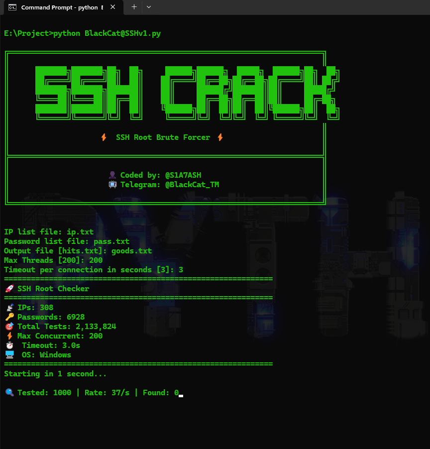

# BlackCat-SSHv1
SSH Brute force 
# 🐈‍⬛ BlackCat SSH Cracker

<p align="center">
  
  
  
  
</p>

<p align="center">
  <b>⚡ Ultra Fast SSH Root Brute Forcer - Async & Multi-Threading</b>
</p>
#Telegram : https://t.me/BlackCat_TM
<p align="center">
  
</p>
---

## 📥 Installation (Linux)

```bash
# 1. Clone repository
git clone https://github.com/S1A7ASH/BlackCat-SSHv1.git

# 2. Go to directory
cd BlackCat-SSH

# 3. Install requirements
pip install -r requirements.txt

# 4. Run
python3 BlackCat@SSHv1.py

